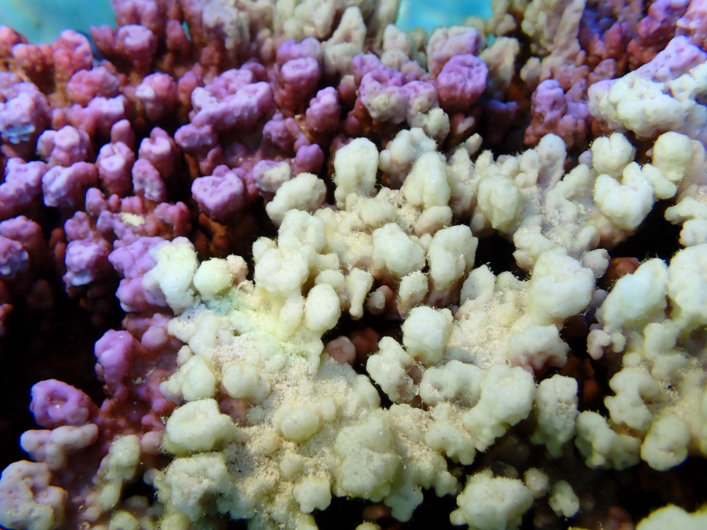

<div align="center">



<sub><i>A wounded <b>Pocillopora</b> colony on the fore reef at Mo'orea, French Polynesia — pale tissue marks a healing wound against pigmented, intact coral.</i></sub>

<h1>Coral wound type, healing &amp; regeneration</h1>

<p><i>Deep tissue removal facilitates algal colonization and inhibits healing and<br>regeneration in three reef-building corals.</i></p>

<p>Analysis code &amp; data for <b>Seifert, Brzezinski, Osenberg &amp; Stier (2026)</b></p>

<p>
  
  = 4.3">
  
  
</p>

</div>

---

Two field experiments at **Mo'orea, French Polynesia** ask how the *type* of a
coral wound shapes what happens next. We compare two ways of injuring a colony:

> - **airbrush** — tissue-only removal (deep tissue stripped away, skeleton left intact)
> - **scrape** (`dremel` in the data/code) — tissue **and** skeletal damage

Scraped wounds regenerated rapidly, whereas deep tissue removal let **algae
colonize** the wound bed and delayed or prevented regeneration — and
*Pocillopora* regenerated more slowly than *Acropora* and *Porites*.

## Overview

- **Experiment 1** (*Acropora*, *Pocillopora*, *Porites*) — 22 paired
  split-colony fragments (11 parents × 2 treatments), 154 observations over 28
  days. Outcomes: regeneration (polyps in the wound centre), healing (coenosarc
  closure), and algal/debris colonization.
- **Experiment 2** (*Porites* spp.) — 206 observations, 15 colonies, 3 treatments
  (airbrush / scrape / airbrush + scrape) over 63 days; up to ~10
  microscope-scored wound-response metrics.
- **Experiments 3 & 4** are qualitative (single-polyp regeneration; histology)
  with **no dataset or code** — reported descriptively in the manuscript.

All reported statistics are **regenerated** by the pipeline; this README never
hardcodes them. After `make all`, read the numbers from:

- Exp 1: `output/tables/exp1_fragment_level_primary.csv`, `output/text/paper_results_summary.md`, `output/tables/`
- Exp 2: `output/exp2_tables/PUBLICATION_STATISTICS_TABLE.csv`, `output/exp2_tables/MULTIPLE_TESTING_CORRECTION.csv`

## Methods (condensed)

Binary wound-response outcomes are modeled with **generalized linear mixed
models**.

**Experiment 1** — the paired split-colony design has 7 repeated timepoints per
fragment, which are *not* independent, so the **primary** analysis is
design-respecting and fragment-level (*n* = 22): paired **exact McNemar** tests
across the 11 within-parent pairs, per-fragment **Firth penalized-likelihood**
models (profile-likelihood CIs), and per-species day-28 Fisher exact tests.
Timepoint-level GLMMs (`lme4`, Firth, ordinal CLMM) are reported as **supporting
sensitivity**, with the repeated-measures limitation stated explicitly.

**Experiment 2** — `glmmTMB` (`outcome ~ treatment * ns(day, 3) + (1 | id)`),
with a single **joint test** of the full treatment × time interaction block per
outcome. Outcomes exhibiting complete separation are fitted with a **penalized
binomial GLMM** (weakly-informative Normal prior on the fixed effects; Gelman et
al. 2008). The six *a priori* *Porites* outcomes are corrected for multiplicity
with **Benjamini–Hochberg (FDR)** as the correction of record (Bonferroni as a
conservative sensitivity). DHARMa residual diagnostics are seeded for
determinism.

<details>
<summary><b>Honest limitation</b> (dispersion diagnostics)</summary>

The DHARMa dispersion test is flagged on most penalized *Porites* models, but
dispersion is not separately identifiable for Bernoulli outcomes, so it is
reported descriptively rather than used as an acceptance gate; an
observation-level random effect is not estimable at these per-cell sample sizes.
Inference rests on the penalized GLMM with this limitation stated.
</details>

## Reproduce

```bash
Rscript scripts/install_dependencies.R   # one-time
make all                                 # full pipeline (~1 min)
make verify                              # integrity self-check
```

Requires **R ≥ 4.3** (tested on R 4.5.2). Exact package versions from the
reference run are in `output/text/sessionInfo.txt`. Run every command from the
repository root.

## Figures reproduced by this code

This repository regenerates the manuscript's **data figures**. After `make all`:

| Manuscript figure | Regenerated file | Script |
|---|---|---|
| Fig 2B — regeneration × species × wound type, with algal-prevalence overlay | `output/figures/regenerated_composition_with_debris_overlay_*.pdf` / `.png` | `airbrush_dremel_10_15_2025.R` |
| Fig 3 data panel — *Porites* wound-response outcomes over time by treatment | `output/exp2_figures_main/figure2_porites_all_outcomes.pdf` / `.png` | `exp2_02_create_figures.R` |
| Data supplement — *Porites* early-timepoint dynamics | `output/exp2_figures_supplement/figureS2_porites_early_dynamics.pdf` / `.png` | `exp2_05_create_early_timepoint_figure.R` |

All other manuscript figures — anatomy diagrams, in-situ wound photographs,
photomicrographs, RFP/native-GFP imaging, and histology — are **images or
Illustrator composites with no code source**, and are not part of this
repository by design.

## Layout

```
data/      authoritative inputs + column dictionaries (data/README.md)
scripts/   analysis pipeline (Exp 1 + Exp 2), verify_pipeline.R, Makefile driver
output/    regenerated tables, figures, and diagnostics
assets/    README media
```

## Citation

If you use this code or data, cite it via `CITATION.cff` (GitHub's *"Cite this
repository"* button); cite the study itself via the article listed there.

## License

Code and data released under the **MIT License** (see `LICENSE`). The reef photo
above is © the study authors.
